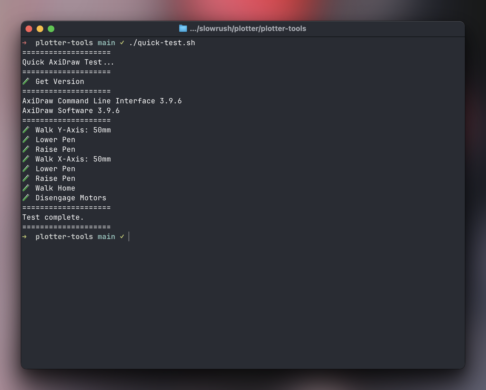

# Plotter Tools

Quick/dirty tools for getting started with AxiDraw plotting.

## Requirements

- [AxiDraw](https://axidraw.com/)
- Python 3
- [AxiCLI](https://axidraw.com/doc/cli_api/)
  ```bash
  # Quick install:
  python -m pip install https://cdn.evilmadscientist.com/dl/ad/public/AxiDraw_API.zip
  ```

## Quick AxiDraw CLI Test

Run a few quick tests to ensure communication with the AxiDraw is working + motors and pen are functioning.

```bash
chmod +x quick_test.sh
./quick_test.sh
```


